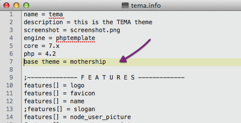
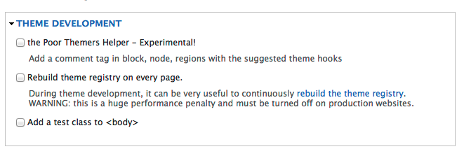
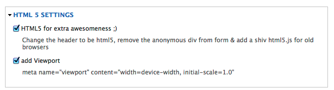
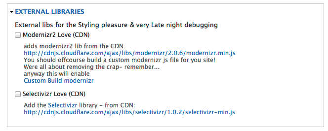
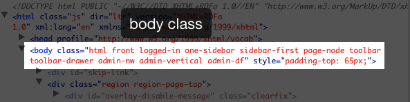
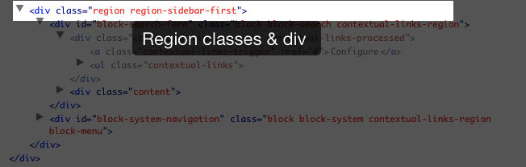
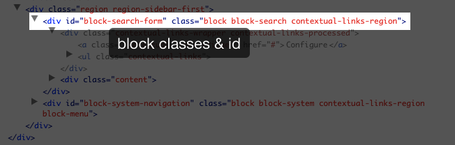

                      __    __                            __                    
                     /\ \__/\ \                          /\ \      __           
      ___ ___     ___\ \ ,_\ \ \___      __   _ __   ____\ \ \___ /\_\  _____   
    /' __` __`\  / __`\ \ \/\ \  _ `\  /'__`\/\`'__\/',__\\ \  _ `\/\ \/\ '__`\ 
    /\ \/\ \/\ \/\ \L\ \ \ \_\ \ \ \ \/\  __/\ \ \//\__, `\\ \ \ \ \ \ \ \ \L\ \
    \ \_\ \_\ \_\ \____/\ \__\\ \_\ \_\ \____\\ \_\\/\____/ \ \_\ \_\ \_\ \ ,__/
     \/_/\/_/\/_/\/___/  \/__/ \/_/\/_/\/____/ \/_/ \/___/   \/_/\/_/\/_/\ \ \/ 
        Fixing everything that is wrong (tm)                              \ \_\ 
                                                                           \/_/

#the Mothership
The mothership theme is a basetheme that once and for all will drop Drupals obscure love for wrapping everything into divs & slapping on 3 css classes everywhere its possible.
This theme will not make your site look neat - but it will clean up the html that Drupal provides out of the box, give you tools so you can remove the css classes that you dont need, without using countless of hours to clean up.

If you really like the markup & css options that Drupal Provides - This theme is probably not for you, and thats perfectly ok, this theme won't do anything for you.
If you on the other hand cares about the markup & css This could be a good start solution.

#Installation
The Mothership is a basetheme so you can build themes on top of it & inherit all the glorious cleanup that the mothership brings you.

themename.info   
**base theme = mothership **   

   
_tema.info file_

#Settings
The heart of the mothership is the markup & css cleaning.  
Lets be honest here, if every class & wrapper div was removed it would end up with basic functionality that didn't work. 
You would have to do a lot of work every time you had to identify any element on the site (actually back tracking into the center of drupal & you would never  come back from) 
So to make it a bit easier for me (and hopefully also you) to remove, or add, class's & markup that we might need all this is done in the settings.

These settings will be global in you drupal theme, but as always you can overwrite these with theme functions or .tpl files. 
Look in the theme suggestion for those (more about that in the theme development settings)

##Theme Development

**Poor themers helper**   
is a little hack where you can get the theme hook suggestions written out in a comment in the markup

   
_poor themes to the rescue_

**Rebuilding the theme**   
when you get tired of doing _drush cc all_ day    

**.test class**   
It can be very practical during developerment to have a test class in the body tag for showing a grid.png etc

##HTML5 Settings
 
**HTML5**
This will change the &lt;!doctype&gt; and make sure that we load a shiv (html5.js) so lesser browsers can understand nav, header, footer etc. 

##Adding Libraries for browserfun

Quick & easy loading of libraries that can be very helpfull

**modernizr2**    
This will load modernizr2 with all its glory from a CDN
This can be good for a development environment but you should off course build a custom modernizer.
[modernizr](http://modernizr.com)

**Selectivizr**
Loads the selectivizr project to help getting old versions of ie to understand how the world should look like.
Its loaded from a CDN so we don't have to carry it around.

##CSS Files 

##class cleanup from the markup 

### &lt;body class="…

### &lt;div class="region …

### &lt;div id="block-[module]" class="block …

### &lt;div id="node-[nid]" class="node …

## Drupal6 - Drupal7
Drupal6
only very minimal work will be done here aka security bug fixes etc. 
if you would like to battle it out with d6 well be my guest please contact me :)

All main work goes into Drupal7 as of today D7 have been out in almost a year.

## Bug Reports etc
Just to make it clear the Mothership is NEVER to blame - its always drupals fault!
… if it should happend that theres actually a bug somewhere, please use the mothership issueque for this. 
I won't answer emails about it only in the issueque

[Mothership issues](http://drupal.org/project/issues/mothership)